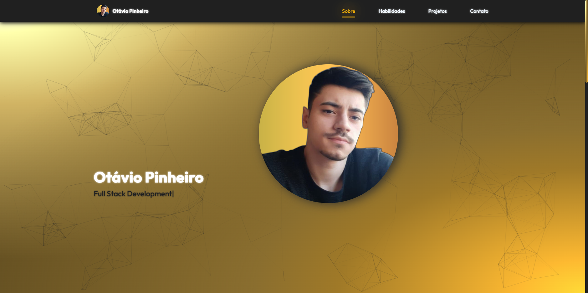

# Portfólio

<h4 align="center"> 
 Finalizado! 🚀
</h4>

## 💻 Sobre:

Este projeto de portfolio foi desenvolvido com o intuito de me apresentar, oferecer o meu trabalho, divulgar os meus projetos e também mostrar a minha evolução como um desenvolvedor web.

## 📝 O site é composto por:

- **Home:** Minha apresentação;
- **Sobre:** Falo um pouco sobre a minha história;
- **Habilidades:** As tecnologias que mais tenho conhecimento;
- **Projetos:** Projetos recentes que eu fiz;
- **Contato:** Área com os meios de contato para falar comigo;

## 🏁 Instalação:

Antes de começar, é bom ter um editor para trabalhar com o código, como: [VSCode](https://code.visualstudio.com/). Clone este repositório usando git clone: https://github.com/otaviopdev/Portfolio.git ou clique em Code/Download ZIP. Clique no arquivo "index.html" e veja a aplicação.

## 🛠️ Tecnologias Utilizadas:

Principais tecnologias usadas neste projeto:

- [HTML5](https://developer.mozilla.org/pt-BR/docs/Web/HTML)
- [CSS3](https://developer.mozilla.org/pt-BR/docs/Web/CSS)
- [JavaScript](https://developer.mozilla.org/pt-BR/docs/Web/JavaScript)
- [AOS-Animate on scroll library](https://michalsnik.github.io/aos/)

## 📄 Licença:

Este projeto está sob a licença MIT. Veja o arquivo [LICENSE](https://github.com/otaviopdev/Portfolio/blob/main/LICENSE) para mais detalhes.

## ✒ Autor:

<a href="https://github.com/otaviopdev">
  
  
 <b>Otávio Pinheiro</b>
</a> 
<a href="https://github.com/otaviopdev" title="Github">🚀</a>

Feito com ❤️ por Otávio Pinheiro. Entre em contato! 👋🏽

